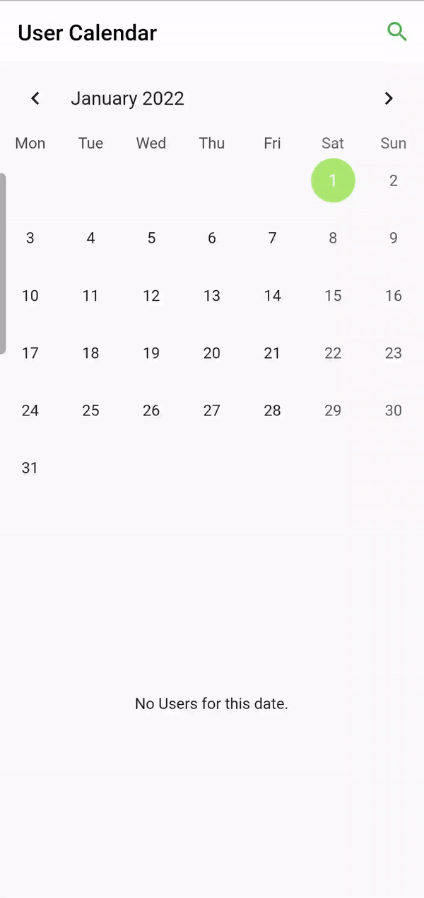

# Flutter User Calendar
A flutter app that displays registered users on a calendar/list and allows to search for users using the full name. 

## Build&Run

Get the dependencies using:
`flutter pub get`

Run the command in the project root folder to build and run on a mobile device:
`flutter run`

To run the app on web use:
`flutter run -d chrome`

To run the tests use:
`flutter test`
